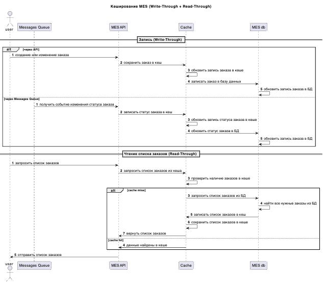

### Задание 5. Кеширование

##### Мотивация:
Сейчас когда операторы заходят на первую страницу MES, система долго прогружается, и фильтрация с пагинацией не решили проблему.
Поэтому на данный момент самый большой профит даст кеширование в MES. При чём больше всего запросов там происходят на чтение, а не запись

Поэтому если внедрить кеширование в MES, то это поможет:
- снизить лишнюю нагрузку на БД
- улучшит пользовательский опыт
- ускорит работу операторов
- повысит лояльность клиентов, тк у них будет меньше проблем с заказами и они будут обрабатываться быстрее

##### Предлагаемое решение:
1. кеширование на клиенте: для различных словарей, справочных данных, различной статики и тд — тк эти данные очень редко меняются их удобнее кешировать на клиенте, не создавая доп нагрузку на сервера
2. серверное кеширование в MES — тк эти данные могут изменяться, а клиент должен работать всегда с актуальными данными, а также на сервере удобнее управлять инвалидацией кеша для таких случаев(например, при изменении заказа)
    - используем сочетание двух паттернов `Write-Through` и `Read-Through` — комбинация этих двух стратегий гарантирует актуальность данных в кеше и повышает скорость доступа к ним при повторных запросах

###### Диаграмма последовательности действий (Sequence diagram)
[jewerly_sequence_diagram_task5.puml](jewerly_sequence_diagram_task5.puml)

###### Причины выбора Write-Through:
- тк заказы изменяются довольно часто(например, меняется статус заказа или добавляется новый заказ), то важно актуализировать данные в кеше, что снижает риски неконсистетности данных в кеше и БД
- точечное обновление данных в кеше по конкретным заказам
- тк система не очень стабильна, лучше использовать этот паттерн, чтобы не получать дополнительных проблем в случае сбоев работы кеша/БД

###### Причины выбора Read-Through:
- гарантия быстрого получения данных и их актуальности
- при этом паттерне не бывает cache-miss — соответственно не нужна дополнительная логика про это
- хорошо сочетается с Write-Through

###### Стратегия инвалидации кеша:
1. инвалидация на основе изменений:
    - когда статус заказа изменился, MES должен удалить из кеша соответствующий ключ, чтобы при последующем чтении получить актуальные данные о заказе даже на списке заказов, а не только на странице одного заказа(гранулярность обновления кеша)
    - хорошо сочетается с Write-Through
    - позволит операторам получать всегда актуальные данные, и снизит нагрузку на БД, тк реальный поход в БД будет происходить только для изменившихся заказов

2. остальные стратегии либо сильно сложны в реализации, либо не гарантируют актуальность данных заказа что может привести к тому, что 2 оператора возьмут один и тот же заказ, а также не все стратегии инвалидации позволяют точечно обновлять данные в кеше, чтобы загрузка списка заказа оставалась оптимальной с точки зрения кол-ва реальных запросов в БД + с актуальными данными